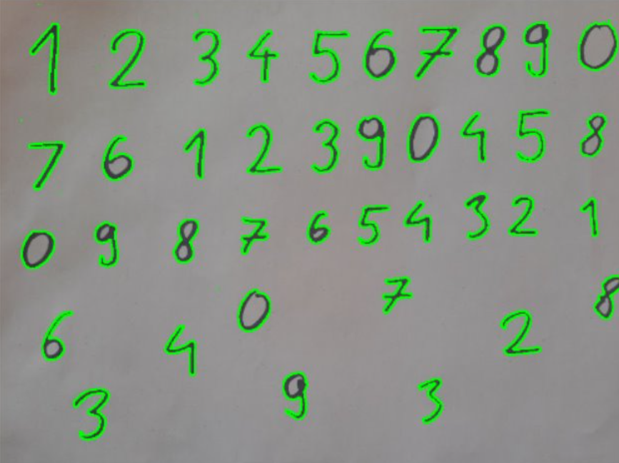

# Number recognition and image segmentation using SVM

*classifier.py* - training an SVM classifier for handwritten digit recognition from MNIST dataset and saving it to a file. Creates a svm_classifier.pkl in given directory for other scripts to use pre-trained Supported Vector Classifier. \
*split.py* - splitting an image called handwritten.jpg of handwritten digits into jpg images of single characters and preprocessing them for image recognition. Saves images of single characters into a split_images folder in a given directory. \
*classify_from_split.py* - importing jpg images into a csv file – *digits.csv* - as binary values for image size 28x28 and classifying them according to imported classifier - *svm_classifier.pkl* \
## For running above scripts following Python packages are required:
- `pandas`
- `scikit-learn`
- `joblib`
- `opencv-python`
- `numpy`

***
